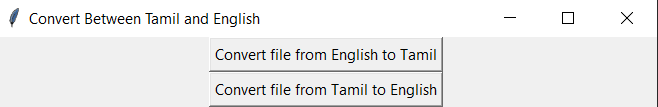

This Project implements a simple GUI to convert songs lyrics between Tamil and English

The GUI Looks Like :

The program uses a dictionary where:

        "saa": "ஸா",  
        "sa": "ஸ",  
        "ree": "ரீ",  
        "ri": "ரி",  
        "gaa": "கா",    
        "ga": "க",  
        "maa": "மா",  
        "ma": "ம",  
        "paa": "பா",  
        "pa": "ப",  
        "daa": "தா",  
        "da": "த",  
        "nii": "நீ",  
        "ni": "நி"  
        

After clicking on the **Convert file from English to Tamil** or **Convert file from Tamil to English** button,  
you will have to choose the file you enter.  

Then the file will be converted to the other language.  
The file will be added to the same directory as your input file.